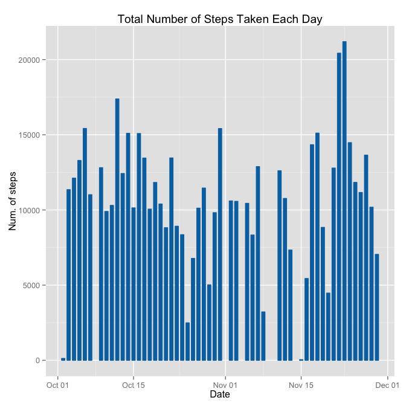
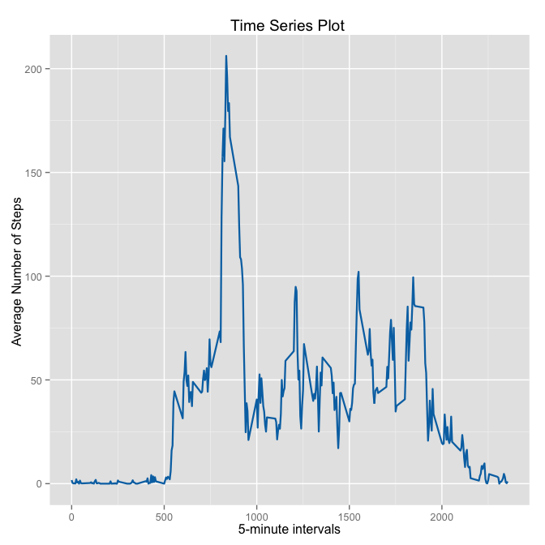
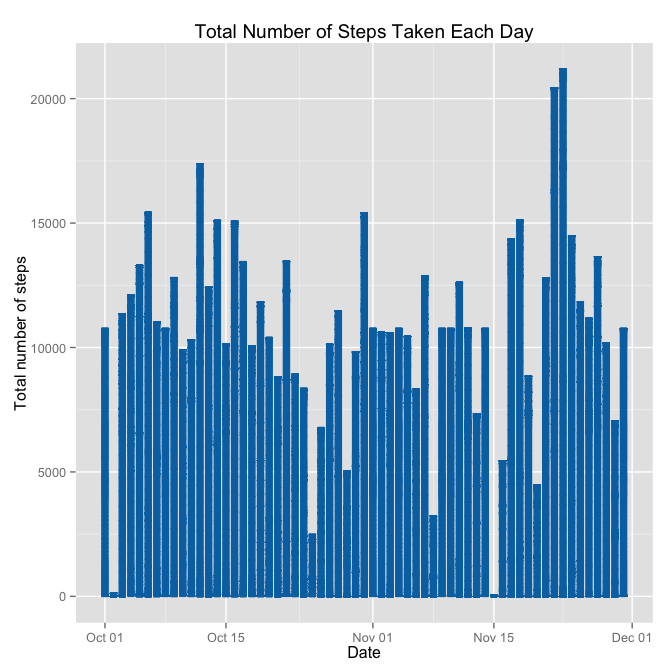
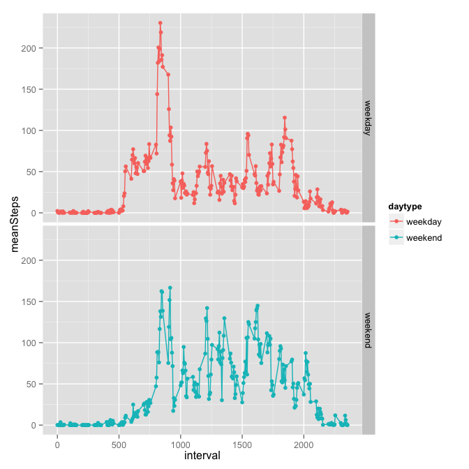

# Reproducible Research: Peer Assessment 1
Francisco Ghersi  

==========================================


### Basic settings

```r
library(ggplot2)
```

### Loading and processing the data

```r
unzip("activity.zip")
activity <- read.csv("activity.csv", colClasses = c("integer", "Date", "factor"))
activity$month <- as.numeric(format(activity$date, "%m"))
activity.noNA <- na.omit(activity)
```


### What is mean total number of steps taken per day?
For this part of the assignment, you can ignore the missing values in the dataset.

* Calculate the total number of steps taken per day

```r
Totalsteps.date.noNA <- aggregate(steps ~ date, data = activity.noNA, FUN = sum)
names(Totalsteps.date.noNA)[2] <- "totalsteps"
head(Totalsteps.date.noNA)
```

```
##         date totalsteps
## 1 2012-10-02        126
## 2 2012-10-03      11352
## 3 2012-10-04      12116
## 4 2012-10-05      13294
## 5 2012-10-06      15420
## 6 2012-10-07      11015
```
* Make a histogram of the total number of steps taken each day

```r
ggplot(Totalsteps.date.noNA, aes(date, totalsteps)) + 
        geom_bar(stat = "identity", 
                 colour = "#0072B2", 
                 fill = "#0072B2", 
                 width = 0.6) + 
        labs(title = "Total Number of Steps Taken Each Day", 
             x = "Date", 
             y = "Num. of steps")
```

 

* Calculate and report the mean and median total number of steps taken per day.
  
  
Mean total number of steps taken per day:

```r
totalSteps <- aggregate(activity.noNA$steps, 
                        by=list(Date = activity.noNA$date), 
                        FUN = "sum")
Mean<-mean(totalSteps$x)
Mean
```

```
## [1] 10766.19
```
Median total number of steps taken per day:

```r
Median<-median(totalSteps$x)
Median
```

```
## [1] 10765
```

### What is the average daily activity pattern?
* Make a time series plot (i.e. type = "l") of the 5-minute interval (x-axis) and the average number of steps taken, averaged across all days (y-axis)


```r
steps.interval <- aggregate(activity.noNA$steps, 
                            by=list(interval = as.numeric(
                                    as.character(activity.noNA$interval))), 
                            FUN = "mean")


ggplot(steps.interval, aes(interval, x)) + 
        geom_line(size = 0.8,
                  colour="#0072B2") + 
        labs(title = "Time Series Plot ", 
             x = "5-minute intervals", 
             y = "Average Number of Steps ")
```

 

* Which 5-minute interval, on average across all the days in the dataset, 
  contains the maximum number of steps?

```r
steps.interval$interval[which.max(steps.interval$x)]
```

```
## [1] 835
```

### Imputing missing values
* Calculate and report the total number of missing values in the dataset (i.e. the total number of rows with NAs).


```r
sum(is.na(activity))
```

```
## [1] 2304
```

* Devise a strategy for filling in all of the missing values in the dataset.The 
strategy does not need to be sophisticated. For example, you could use 
the mean/median for that day, or the mean for that 5-minute interval, etc.

The strategy is to use the mean for that 5-minute interval to fill each NA value.

* Create a new dataset that is equal to the original dataset but with the missing data filled in.


```r
activity.NAfilled <- activity
for (i in 1:nrow(activity.NAfilled)) {
    if (is.na(activity.NAfilled$steps[i])) {
        activity.NAfilled$steps[i] <- steps.interval[
                which(activity.NAfilled$interval[i] == steps.interval$interval), 
                ]$x
    }
}


sum(is.na(activity.NAfilled))
```

```
## [1] 0
```

* Make a histogram of the total number of steps taken each day and Calculate and report the mean and median total number of steps taken per day. 


```r
ggplot(activity.NAfilled, aes(date, steps)) + 
        geom_bar(stat = "identity",
                colour = "#0072B2",
                fill = "#0072B2",
                width = 0.7) + 
        labs(title = " Total Number of Steps Taken Each Day ", 
             x = "Date", 
             y = "Total number of steps")
```

 

* Do these values differ from the estimates from the first part of the assignment? What is the impact of imputing missing data on the estimates of the total daily number of steps?

Mean total number of steps taken per day imputing missing data:

```r
totalSteps.NAfilled <- aggregate(activity.NAfilled$steps, 
                        by=list(Date = activity.NAfilled$date), 
                        FUN = "sum")
Mean.NAfilled <- mean(totalSteps.NAfilled$x)
Mean.NAfilled 
```

```
## [1] 10766.19
```
Median total number of steps taken per day imputing missing data:

```r
Median.NAfilled <- median(totalSteps.NAfilled$x)
Median.NAfilled
```

```
## [1] 10766.19
```
Compare them with the two before imputing missing data:

  *Mean

```r
abs(Mean - Mean.NAfilled)
```

```
## [1] 0
```
  *Median

```r
abs(Median - Median.NAfilled)
```

```
## [1] 1.188679
```
So, if we use the mean for that 5-minute interval to fill each NA value, the mean
of total steps taken per day is the same in both cases and the impact of the 
missing data seems rather low on median. 

### Are there differences in activity patterns between weekdays and weekends?

* Create a new factor variable in the dataset with two levels -- "weekday" and "weekend" indicating whether a given date is a weekday or weekend day.

```r
daytype <- function(date) {
    if (weekdays(as.Date(date)) %in% c("Saturday", "Sunday")) {
        "weekend"
    } else {
        "weekday"
    }
}
activity.NAfilled$daytype <- as.factor(sapply(activity.NAfilled$date, daytype))
```

* Make a panel plot containing a time series plot (i.e. type = "l") of the 5-minute interval (x-axis) and the average number of steps taken, averaged across all weekday days or weekend days (y-axis).


```r
Steps.avg <- aggregate(activity.NAfilled$steps, 
                      list(interval = as.numeric(as.character(activity.NAfilled$interval)), 
                           daytype = activity.NAfilled$daytype),
                      FUN = "mean")
names(Steps.avg)[3] <- "meanSteps"

ggplot(Steps.avg, aes(interval, meanSteps, color = daytype))+
        geom_point()+
        facet_grid(daytype ~ .) +
        geom_line()
```

 
